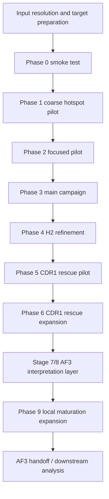

# Noroantibody: A Stage-Wise Computational Pipeline for Norovirus Nanobody Redesign

## Overview
`Noroantibody` is the pipeline-focused repository for a staged computational redesign project on a Norovirus nanobody–P-domain dimer system. The codebase packages the actual project logic used through Stage 9: hotspot-guided exploration, antibody-aware backbone generation, ProteinMPNN sequence design, RF2 surrogate filtering, later-stage local maturation, and downstream AF3 handoff / interpretation utilities.

This repository is intended to function like a publication companion codebase rather than a lab notebook dump. The emphasis is on:

- reproducible phase orchestration
- explicit YAML configuration for campaign and phase logic
- lightweight but real helper scripts for preparation, validation, ranking, and AF3 export
- enough project context that a technically competent reader can understand, deploy, and extend the workflow

The central scientific picture that emerges from the pipeline is not simple WT recovery. WT remains the stability reference, while later designed candidates repeatedly occupy a distinct alternative interface mode. In the later local-optimization stages, CDR1-centered behavior becomes the dominant mechanistic lever.

## Scope and Safety
This is a computational structural modeling and protein design repository only.

- No infectious virus work
- No viral propagation
- No wet-lab procedures
- No animal or human experimentation
- No clinical samples
- No local AlphaFold 3 deployment inside this repository

AF3 is treated here as an external downstream analysis layer after RF2-based triage.

## What This Repository Is
This repository is the **pipeline-only** project package.

Included:
- staged RFantibody-style pipeline orchestration
- hotspot campaign definitions
- target preparation and residue mapping utilities
- wrappers around RFdiffusion / ProteinMPNN / RF2 execution
- phase logic through Stage 9
- ranking, filtering, deduplication, and export utilities
- downstream AF3 analysis helpers used after external AF3 runs

Intentionally excluded from git:
- downloaded model weights
- large third-party framework payloads
- VM/cloud intermediate run directories
- raw AF3 result folders
- the separate BIEN225 cellular automaton layer (`Noroantibody_AC`)

## Compact Scientific Framework
The project is easier to understand as a four-part framework than as a long chronological log.

### 1. Broad exploration
Early phases ask a structural question: which antigen-side hotspot logic is worth pursuing at all?

Core pattern:
- generate backbones with antibody-aware RFdiffusion
- design sequences with ProteinMPNN
- filter with RF2

Main campaign families:
- `campaign_A_core`
- `campaign_B_A_plus_D_rim_bridge`
- `campaign_C_A_plus_pocket_rim_HBGA_adjacent`

### 2. Narrowing with surrogate filtering
The project then uses RF2 as the high-throughput structural surrogate to avoid spending expensive downstream analysis on weak design lines.

Main filters:
- RF2 pAE
- design-vs-RF2 RMSD
- sequence deduplication
- phase-level combination ranking tables

### 3. Region-focused optimization
After broad search converged, the project stopped behaving like a de novo campaign and became a local maturation workflow.

Late-stage themes:
- H2 refinement
- CDR1 rescue
- Test1-centered local maturation
- champion-consensus narrowing
- Phase 9 branch expansion

### 4. Final reference candidates for downstream interpretation
By the end of Stage 9, the project had three useful downstream anchors:
- `WT`: stability and interface-maturity reference
- `spg3_024`: broader alternative-pose comparator
- `p9c_052 / spg1_020`: compact alternative-pose candidate

## Key Scientific Takeaways
1. **WT remains the stability reference.**  
   Designed candidates can challenge parts of WT’s interface logic, but WT remains the strongest confidence/stability benchmark.

2. **The designed family does not simply converge onto WT.**  
   The strongest engineered candidates repeatedly favor an alternative binding pattern.

3. **CDR1 behavior is the main late-stage differentiator.**  
   Later optimization repeatedly acts through CDR1-local support logic rather than full-antibody redesign.

4. **Compact support-coupled designs are more informative than broad spread alternatives.**  
   Later-phase success is not just about score maxima; it is about preserving a coherent alternative binding mode.

## Pipeline-at-a-Glance


## Stage Map
| Stage | Purpose | Representative outputs |
|---|---|---|
| `phase0_smoke` | validate environment and end-to-end wiring | `results/summaries/phase0_smoke_summary.csv` |
| `phase1_coarse_pilot` | broad hotspot family screen | `phase1_top8_combinations.csv` |
| `phase2_focused_pilot` | refine early winning combinations | `phase2_top2_combinations.csv` |
| `phase3_main_campaign` | production-scale search on top combinations | `phase3_top25_pre_h2.csv` |
| `phase4_h2_refine` | H2-only optimization of top candidates | `final25_h2_optimized_candidates.csv` |
| `phase5_cdr1_rescue_pilot` | compare rescue conditions | `phase5_cdr1_rescue_condition_ranking.csv` |
| `phase6_cdr1_rescue_main` | expand best rescue condition(s) | `phase6_cdr1_rescue_final_ranked_candidates.csv` |
| `phase_next_test1_local_maturation` | Test1-centered local maturation | `phase_next_test1_local_maturation_rf2_summary.csv` |
| `phase_next_champion_narrow50` | narrowed champion-consensus test | `phase_next_champion_narrow50_rf2_summary.csv` |
| `phase9_test1_local_maturation_expand150` | branch expansion at larger scale | `phase9_test1_local_maturation_expand150_rf2_summary.csv` |

A concise stage interpretation is maintained in [docs/pipeline_stage_summary.md](docs/pipeline_stage_summary.md).

## Repository Layout
```text
.
├── data/
│   ├── configs/                 # pipeline, phase, hotspot, tooling, rescue/local-maturation configs
│   ├── maps/                    # residue mapping tables
│   ├── processed/               # resolved inputs/targets and lightweight derived metadata
│   ├── raw/                     # lightweight provenance assets only
│   └── target/                  # prepared target examples and reports
├── docs/                        # deployment, architecture, configuration, and output guides
├── scripts/                     # orchestration, preparation, wrappers, ranking, export, analysis
├── Nanobody.fa                  # example nanobody sequence input
├── Nanobody.pdb                 # example framework structure input
├── VP1.prot                     # example antigen sequence input
├── P-domain dimer.prot          # example antigen dimer sequence input
├── environment.yml
├── requirements.txt
└── README.md
```

## Documentation Roadmap
If you are deploying or reading the repository for the first time, use these in order:

1. [README.md](README.md)  
   Project scope, pipeline shape, and quick-start entrypoints.
2. [docs/deployment_quickstart.md](docs/deployment_quickstart.md)  
   Environment setup, required edits, smoke test, and first executable run.
3. [docs/pipeline_architecture.md](docs/pipeline_architecture.md)  
   Detailed description of how the staged pipeline is organized and why.
4. [docs/configuration_reference.md](docs/configuration_reference.md)  
   What each YAML file controls and how to customize campaigns and phases.
5. [docs/output_reference.md](docs/output_reference.md)  
   What the main output tables mean and how later phases branch from earlier ones.
6. [docs/WHAT_YOU_STILL_NEED_TO_FILL_IN.md](docs/WHAT_YOU_STILL_NEED_TO_FILL_IN.md)  
   Explicit deployment checklist for environment-specific fields.

## Installation and External Dependencies
### Option A: conda
```bash
conda env create -f environment.yml
conda activate noro_rfantibody
```

### Option B: venv + pip
```bash
python3 -m venv .venv
source .venv/bin/activate
pip install -r requirements.txt
```

### Required external tool stack
This repository assumes that RFantibody-style tooling is installed separately and accessible from your environment.

Typical setup pattern:
```bash
cd data/framework/external/RFantibody
pip install -e .
bash include/download_weights.sh
cd -
```

Important:
- the external framework payload is intentionally not versioned here
- weight paths and command prefixes are resolved via `data/configs/tooling.yaml` or `tooling.detected.yaml`
- you must provide a valid framework PDB/mmCIF for real RFdiffusion execution

## Input Model
The pipeline separates **logical project inputs** from **filesystem aliases**.

Representative inputs used in this project:
- `VP1.prot`
- `P-domain dimer.prot`
- `Nanobody.fa`
- `Nanobody.pdb`

In `data/configs/pipeline.yaml`, these may appear as normalized names such as `Nanobody.fasta` or `P-domain dimer.fasta`. The preparation layer resolves filename aliases rather than requiring you to rename original files. This is intentional and helps preserve provenance.

## Minimal Deployment Path
For a first local deployment, the practical sequence is:

```bash
python scripts/prepare_inputs.py
python scripts/prepare_targets.py \
  --pipeline-config data/configs/pipeline.yaml \
  --campaign-config data/configs/hotspot_campaigns.yaml
python scripts/autodetect_runtime_and_tooling.py --strict
python scripts/dry_run_validate.py
```

A helper shell entrypoint is also included:

```bash
bash scripts/bootstrap_and_smoke.sh
```

## Full Phase Execution Pattern
Main entrypoint:

```bash
python scripts/run_pipeline.py --phase <phase_name>
```

Examples:
```bash
python scripts/run_pipeline.py --phase phase0_smoke
python scripts/run_pipeline.py --phase phase1_coarse_pilot
python scripts/run_pipeline.py --phase phase2_focused_pilot
python scripts/run_pipeline.py --phase phase3_main_campaign
python scripts/run_pipeline.py --phase phase4_h2_refine
python scripts/run_pipeline.py --phase phase5_cdr1_rescue_pilot
python scripts/run_pipeline.py --phase phase6_cdr1_rescue_main
python scripts/run_pipeline.py --phase phase9_test1_local_maturation_expand150
```

Convenience wrappers:
- `scripts/run_phase0.sh`
- `scripts/run_phase1.sh`
- `scripts/run_phase2.sh`
- `scripts/run_phase3.sh`
- `scripts/run_phase4.sh`
- `scripts/run_phase5.sh`
- `scripts/run_phase6.sh`
- `scripts/run_phase_next_test1_local_maturation.sh`
- `scripts/run_phase_next_champion_narrow50.sh`
- `scripts/run_phase9_test1_local_maturation_expand150.sh`
- `scripts/run_all_phases.sh`

## How the Pipeline Is Designed
The practical design logic is distributed across a small set of YAML files.

### Campaign / hotspot logic
- File: `data/configs/hotspot_campaigns.yaml`
- Role: defines which antigen-side residue groups are treated as campaign anchors

Current campaign families:
- `campaign_A_core`
- `campaign_B_A_plus_D_rim_bridge`
- `campaign_C_A_plus_pocket_rim_HBGA_adjacent`

### Loop search space
- File: `data/configs/design_matrix.yaml`
- Role: defines which loops are designed and which H1/H3 length deltas are allowed in the broad-search stages

### Global pipeline behavior
- File: `data/configs/pipeline.yaml`
- Role:
  - project identity
  - input file resolution
  - target preparation parameters
  - default execution behavior
  - hard RF2 thresholds
  - ranking weights
  - AF3 export count

### Phase scaling
- File: `data/configs/phases.yaml`
- Role: defines how many backbones / sequences / parents are used in each stage

### Late-stage local optimization
- Files:
  - `data/configs/cdr1_rescue_phase.yaml`
  - `data/configs/cdr1_rescue_hotspots.yaml`
  - `data/configs/test1_local_maturation_phase.yaml`
  - `data/configs/test1_local_maturation_hotspots.yaml`
  - `data/configs/champion_narrow50_phase.yaml`
  - `data/configs/champion_narrow50_hotspots.yaml`
- Role: encode region-restricted refinement after the broad pipeline has narrowed the design space

## How to Use the Pipeline in Practice
There are really three usage modes.

### 1. Reproduce the original project logic
Use the existing configs and phase definitions as-is. This is the most publication-like use case.

### 2. Run only part of the pipeline
Examples:
- stop after Phase 3 and inspect `phase3_top25_pre_h2.csv`
- rerun only H2 refinement using a custom input CSV
- rerun only rescue or local-maturation phases from existing shortlisted parents

### 3. Adapt the campaign logic while keeping the same project structure
The safest levers are:
- edit hotspot sets in `hotspot_campaigns.yaml`
- edit H1/H3 search deltas in `design_matrix.yaml`
- edit per-phase scale in `phases.yaml`
- edit hard thresholds and ranking weights in `pipeline.yaml`

For a detailed guide, see [docs/configuration_reference.md](docs/configuration_reference.md).

## Output Philosophy
The repository writes lightweight, phase-scoped run directories plus compact machine-readable summaries.

The most important outputs live under:
- `results/summaries/`
- `results/final_25/`
- `results/af3_web_exports*/`
- `logs/<phase>/`

Examples:
- `results/summaries/phase1_top8_combinations.csv`
- `results/summaries/phase2_top2_combinations.csv`
- `results/summaries/phase3_top25_pre_h2.csv`
- `results/summaries/final25_h2_optimized_candidates.csv`
- `results/summaries/phase5_cdr1_rescue_condition_ranking.csv`
- `results/summaries/phase6_cdr1_rescue_final_ranked_candidates.csv`
- `results/summaries/phase_next_test1_local_maturation_rf2_summary.csv`
- `results/summaries/phase_next_champion_narrow50_rf2_summary.csv`
- `results/summaries/phase9_test1_local_maturation_expand150_rf2_summary.csv`

For a more detailed interpretation guide, see [docs/output_reference.md](docs/output_reference.md).

## Downstream AF3 Utilities Included Here
AF3 itself was treated as an external layer, but the project includes the scripts used to bridge RF2-ranked designs into AF3 submission and later interpretation.

Representative scripts:
- `scripts/export_af3_web_package.py`
- `scripts/generate_af3_batch_json.py`
- `scripts/rerank_af3_with_rf2.py`
- `scripts/analyze_af3_interface_stability.py`
- `scripts/analyze_af3_project_master.py`
- `scripts/analyze_phase7_phase8_af3_narrow.py`
- `scripts/analyze_wt_detailed_interactions.py`
- `scripts/analyze_wt_vs_p9c052_af3.py`
- `scripts/plot_wt_interaction_modules.py`

These are included because they were part of the real Stage 7–9 interpretation stack, not because AF3 is executed locally in this repository.

## What a New User Must Edit Before a Real Run
At minimum, confirm or fill:
- `data/configs/cdr_boundaries.yaml`
- `data/configs/pipeline.yaml`
  - input paths
  - `nanobody_framework_pdb_file`
- `data/configs/tooling.yaml`
  - actual command prefixes
  - actual checkpoint paths
- environment-specific GPU / CUDA availability

A checklist version is maintained in [docs/WHAT_YOU_STILL_NEED_TO_FILL_IN.md](docs/WHAT_YOU_STILL_NEED_TO_FILL_IN.md).

## Reproducibility Notes
This repository is deliberately **code-and-config complete but data-light**.

That means:
- the pipeline logic is preserved
- the late-stage design logic is preserved
- the analysis scripts are preserved
- large intermediate directories are not committed
- AF3 raw folders are not committed
- external frameworks and weights are not committed

This is intentional. The repository is meant to be deployable and inspectable without becoming unmanageable in size.

## Recommended Citation-Style Summary
> `Noroantibody` implements a staged computational redesign workflow for a Norovirus nanobody, beginning with hotspot-guided structural exploration and ending with region-focused local maturation in which WT remains the stability reference while designed candidates increasingly favor an alternative, CDR1-sensitive interface mode.
